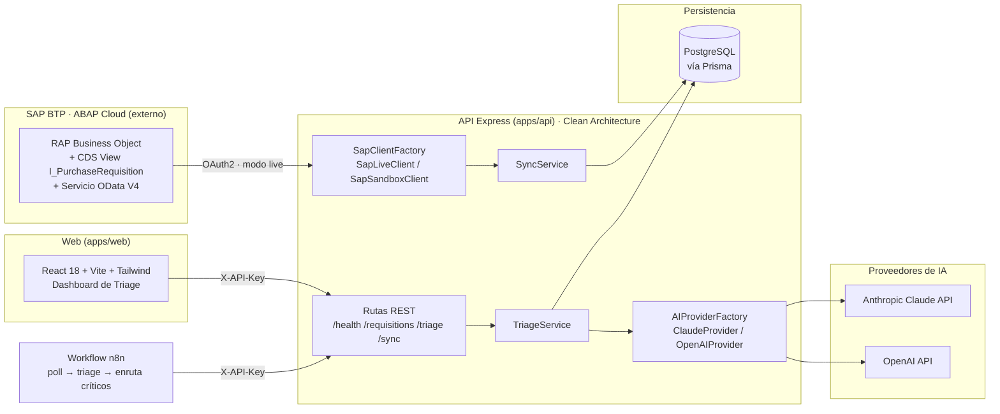

# SAP AI Triage Bridge — Intelligent triage for SAP S/4HANA purchase requisitions


> **Portfolio project** — An AI automation layer that ingests SAP S/4HANA purchase-requisition data (MM module) over OData V4 and runs intelligent triage: anomaly detection, spend categorization, risk scoring, and plain-language summaries.

> **Note** — This repository is **not** an ABAP/SAP-native system. It is a modern TypeScript + AI layer that **consumes** an SAP S/4HANA OData V4 service. It ships a `SAP_MODE=sandbox` client that serves realistic mock data with the exact OData schema, clearly labeled in the UI and in every API response. The ABAP-native artifacts (RAP Business Object, CDS Views, OData V4 service) live in a separate ABAP Cloud module on SAP BTP.

---

<details open>
<summary><h2>🇺🇸 English</h2></summary>

### Architecture


---

### Features

- **SAP OData V4 ingestion** — Pulls MM purchase requisitions (with item navigation `to_PurchaseReqnItem`) and upserts them into PostgreSQL, keeping the raw SAP payload for auditability.
- **Sandbox / live duality** — A single `SAP_MODE` switch flips between a mock client (realistic data, identical OData schema) and a live SAP BTP client using OAuth2 client credentials.
- **AI triage engine** — Per requisition, scores risk (0–100), assigns a risk level (low/medium/high/critical), categorizes spend, infers CAPEX/OPEX budget type, lists anomalies, and writes a plain-language summary plus action recommendations.
- **Swappable AI provider** — A provider abstraction (`AIProvider.interface`) lets you switch between Anthropic Claude and OpenAI via the `AI_PROVIDER` env var without touching business logic.
- **Anomaly heuristics** — Price outliers vs. material-group averages, quantity spikes, missing delivery dates, rush deliveries, missing suppliers on high-value items, and account-assignment checks (K/P/F vs. stock).
- **Hardened REST API** — API-key auth, per-route rate limiting (100/min triage, 10/hour sync), strict CORS allowlist, security headers, request IDs, and structured Pino logging.
- **React triage dashboard** — Filterable requisition table, risk badges, a triage detail panel with a risk donut, and a persistent sandbox banner.
- **n8n automation** — An importable workflow that polls sync, runs triage, and routes critical items downstream.
- **Cost/latency telemetry** — Every triage persists provider, model, prompt/completion tokens, and processing time.

---

### Quick Start

```bash
# Prerequisites: Node.js 20+, pnpm 9+, PostgreSQL 15+

git clone https://github.com/cdgutierrez6/sap-ai-triage-bridge.git
cd sap-ai-triage-bridge

# Install all workspace dependencies
pnpm install

# Configure environment
cp .env.example apps/api/.env
# Edit apps/api/.env — set API_KEY, DATABASE_URL and ANTHROPIC_API_KEY at minimum

# Generate the Prisma client and run migrations
pnpm db:generate
pnpm db:migrate

# Start all dev servers (API on :3001, Web on :5173)
pnpm dev
```

Open `http://localhost:5173` — the dashboard loads with the **SANDBOX MODE** banner. Run tests with `pnpm test` (or `pnpm test:coverage`).

---

### Project Structure

```
sap-ai-triage-bridge/
├── apps/
│   ├── api/                      # Express backend (Clean Architecture)
│   │   ├── prisma/schema.prisma  # PostgreSQL data model
│   │   └── src/
│   │       ├── config/           # env validation (Zod) + Pino logger
│   │       ├── domains/triage/   # TriageService + AI provider abstraction
│   │       ├── infrastructure/   # Prisma client, SAP OData clients, HTTP routes
│   │       ├── sync/             # SAP → DB SyncService
│   │       └── index.ts          # Express entry point
│   └── web/                      # React + Vite + Tailwind dashboard
│       └── src/
│           ├── components/       # RequisitionTable, TriagePanel, RiskBadge…
│           ├── hooks/            # useRequisitions, useTriage
│           ├── pages/            # Dashboard, RequisitionDetail
│           └── services/         # API client
├── packages/
│   └── shared/                   # Shared TS types + Zod schemas (@sap-triage/shared)
├── automation/                   # n8n workflow export
├── docker/                       # Test DB init SQL
├── turbo.json                    # Turborepo pipeline
├── pnpm-workspace.yaml
├── PLANNING.md                   # Architecture decisions, data model, API contract
└── DEPLOY.md                     # Vercel + Neon deployment guide
```

---

### API Reference

All endpoints are versioned under `/api/v1` and require an `X-API-Key` header (except `/health`).

| Method | Endpoint | Description |
|--------|----------|-------------|
| `GET` | `/api/v1/health` | System / DB / SAP-client health check |
| `GET` | `/api/v1/requisitions` | List requisitions with filters (status, riskLevel, plant, date, search) |
| `GET` | `/api/v1/requisitions/:id` | Requisition detail with items + triage result |
| `POST` | `/api/v1/triage/run/:requisitionId` | Run AI triage for one requisition |
| `POST` | `/api/v1/triage/run-batch` | Bulk triage (up to 50 requisitions) |
| `GET` | `/api/v1/triage/:requisitionId` | Fetch an existing triage result |
| `POST` | `/api/v1/sync/trigger` | Pull requisitions from OData (live or sandbox) |
| `GET` | `/api/v1/sync/logs` | Sync history |

Rate limits: **100 req/min** on triage routes, **10 req/hour** on sync.

---

### Environment Variables

| Variable | Description | Required |
|----------|-------------|----------|
| `NODE_ENV` | `development` \| `test` \| `production` | No (default `development`) |
| `PORT` | API port | No (default `3001`) |
| `API_KEY` | Secret for the `X-API-Key` header (min 32 chars) | Yes |
| `DATABASE_URL` | PostgreSQL connection string | Yes |
| `TEST_DATABASE_URL` | Separate DB for integration tests | No |
| `SAP_MODE` | `sandbox` (mock) or `live` (SAP BTP) | No (default `sandbox`) |
| `AI_PROVIDER` | `claude` or `openai` | No (default `claude`) |
| `ANTHROPIC_API_KEY` | Anthropic key | Required when `AI_PROVIDER=claude` |
| `OPENAI_API_KEY` | OpenAI key | Required when `AI_PROVIDER=openai` |
| `CORS_ALLOWED_ORIGINS` | Comma-separated origin allowlist | No (default `http://localhost:5173`) |
| `N8N_WEBHOOK_SECRET` | Shared secret for n8n calls (min 16 chars) | No |
| `SAP_BTP_BASE_URL` / `SAP_BTP_CLIENT_ID` / `SAP_BTP_CLIENT_SECRET` / `SAP_BTP_TOKEN_URL` | OAuth2 live-mode credentials | Required when `SAP_MODE=live` |
| `VITE_API_URL` | API base URL for the web app | Yes (web) |
| `VITE_SAP_MODE` | Mirrors backend `SAP_MODE` for the sandbox banner | No |

---

### Database

PostgreSQL via Prisma. Four tables:

| Table | Purpose |
|-------|---------|
| `purchase_requisitions` | MM requisition header + raw SAP payload + sync metadata |
| `purchase_requisition_items` | Line items (material, quantity, price, plant, account assignment) |
| `triage_results` | AI output: risk score/level, spend category, budget type, anomalies, summary, recommendations, token/latency telemetry |
| `sync_logs` | History of each OData sync (mode, status, records fetched/upserted, duration) |

---

### Tech Stack

- **Turborepo + pnpm workspaces** — Monorepo orchestration and shared caching.
- **Express 5 + TypeScript** — REST API with Clean-Architecture layering.
- **Prisma 5 + PostgreSQL** — Type-safe ORM and relational persistence.
- **Anthropic Claude SDK + OpenAI SDK** — Interchangeable LLM triage providers.
- **Zod** — Runtime validation for env vars, OData payloads, and AI responses.
- **Pino + express-rate-limit** — Structured JSON logging and abuse protection.
- **React 18 + Vite 5 + Tailwind CSS 3** — Fast SPA triage dashboard with React Router.
- **n8n** — Low-code automation workflow (JSON export in `/automation`).
- **Vercel + GitHub Actions** — Deployment target and CI.

---

### Author

**Cristian Daniel Gutiérrez S.** — Solutions Architect | Full-Stack Engineer

[LinkedIn](https://www.linkedin.com/in/cristian-daniel-guti%C3%A9rrez-segura) · [Portfolio](https://portafolio-frontend-wheat.vercel.app) · [cdgutierrez6@gmail.com](mailto:cdgutierrez6@gmail.com)

</details>

---

<details>
<summary><h2>🇨🇴 Español</h2></summary>

### Arquitectura



---

### Características

- **Ingesta OData V4 de SAP** — Extrae purchase requisitions del módulo MM (con navegación de ítems `to_PurchaseReqnItem`) y las hace upsert en PostgreSQL, conservando el payload SAP crudo para auditoría.
- **Dualidad sandbox / live** — Un solo interruptor `SAP_MODE` alterna entre un cliente mock (datos realistas, esquema OData idéntico) y un cliente live de SAP BTP con OAuth2 client credentials.
- **Motor de triage con IA** — Por requisición: puntúa el riesgo (0–100), asigna nivel (low/medium/high/critical), categoriza el gasto, infiere tipo de presupuesto (CAPEX/OPEX), lista anomalías y redacta un resumen en lenguaje natural con recomendaciones.
- **Proveedor de IA intercambiable** — Una abstracción (`AIProvider.interface`) permite cambiar entre Anthropic Claude y OpenAI vía la variable `AI_PROVIDER` sin tocar la lógica de negocio.
- **Heurísticas de anomalías** — Precios atípicos frente a promedios por grupo de material, picos de cantidad, fechas de entrega faltantes, entregas urgentes, proveedores ausentes en ítems de alto valor y verificación de imputación (K/P/F vs. stock).
- **API REST endurecida** — Autenticación por API key, rate limiting por ruta (100/min en triage, 10/hora en sync), allowlist CORS estricta, security headers, request IDs y logging estructurado con Pino.
- **Dashboard de triage en React** — Tabla de requisiciones filtrable, badges de riesgo, panel de detalle con donut de riesgo y banner persistente de sandbox.
- **Automatización con n8n** — Workflow importable que hace poll del sync, corre el triage y enruta los ítems críticos.
- **Telemetría de costo/latencia** — Cada triage persiste proveedor, modelo, tokens de prompt/respuesta y tiempo de procesamiento.

---

### Inicio Rápido

```bash
# Requisitos: Node.js 20+, pnpm 9+, PostgreSQL 15+

git clone https://github.com/cdgutierrez6/sap-ai-triage-bridge.git
cd sap-ai-triage-bridge

# Instalar todas las dependencias del workspace
pnpm install

# Configurar el entorno
cp .env.example apps/api/.env
# Edita apps/api/.env — define API_KEY, DATABASE_URL y ANTHROPIC_API_KEY como mínimo

# Generar el cliente Prisma y correr migraciones
pnpm db:generate
pnpm db:migrate

# Levantar todos los servidores de desarrollo (API en :3001, Web en :5173)
pnpm dev
```

Abre `http://localhost:5173` — el dashboard carga con el banner **SANDBOX MODE**. Corre las pruebas con `pnpm test` (o `pnpm test:coverage`).

---

### Estructura del Proyecto

```
sap-ai-triage-bridge/
├── apps/
│   ├── api/                      # Backend Express (Clean Architecture)
│   │   ├── prisma/schema.prisma  # Modelo de datos PostgreSQL
│   │   └── src/
│   │       ├── config/           # validación de env (Zod) + logger Pino
│   │       ├── domains/triage/   # TriageService + abstracción de proveedor IA
│   │       ├── infrastructure/   # cliente Prisma, clientes OData SAP, rutas HTTP
│   │       ├── sync/             # SyncService SAP → DB
│   │       └── index.ts          # Entry point de Express
│   └── web/                      # Dashboard React + Vite + Tailwind
│       └── src/
│           ├── components/       # RequisitionTable, TriagePanel, RiskBadge…
│           ├── hooks/            # useRequisitions, useTriage
│           ├── pages/            # Dashboard, RequisitionDetail
│           └── services/         # Cliente de API
├── packages/
│   └── shared/                   # Types TS + schemas Zod compartidos (@sap-triage/shared)
├── automation/                   # Export del workflow n8n
├── docker/                       # SQL de init para la DB de test
├── turbo.json                    # Pipeline de Turborepo
├── pnpm-workspace.yaml
├── PLANNING.md                   # Decisiones de arquitectura, modelo de datos, contrato API
└── DEPLOY.md                     # Guía de despliegue Vercel + Neon
```

---

### Referencia de API

Todos los endpoints están versionados bajo `/api/v1` y requieren el header `X-API-Key` (excepto `/health`).

| Método | Endpoint | Descripción |
|--------|----------|-------------|
| `GET` | `/api/v1/health` | Health check del sistema / DB / cliente SAP |
| `GET` | `/api/v1/requisitions` | Lista con filtros (status, riskLevel, plant, fecha, búsqueda) |
| `GET` | `/api/v1/requisitions/:id` | Detalle de requisición con ítems + resultado de triage |
| `POST` | `/api/v1/triage/run/:requisitionId` | Corre el triage con IA para una requisición |
| `POST` | `/api/v1/triage/run-batch` | Triage en lote (hasta 50 requisiciones) |
| `GET` | `/api/v1/triage/:requisitionId` | Obtiene un resultado de triage existente |
| `POST` | `/api/v1/sync/trigger` | Extrae requisiciones desde OData (live o sandbox) |
| `GET` | `/api/v1/sync/logs` | Historial de sincronizaciones |

Límites: **100 req/min** en rutas de triage, **10 req/hora** en sync.

---

### Variables de Entorno

| Variable | Descripción | Requerida |
|----------|-------------|-----------|
| `NODE_ENV` | `development` \| `test` \| `production` | No (default `development`) |
| `PORT` | Puerto de la API | No (default `3001`) |
| `API_KEY` | Secreto para el header `X-API-Key` (mín. 32 chars) | Sí |
| `DATABASE_URL` | Cadena de conexión PostgreSQL | Sí |
| `TEST_DATABASE_URL` | DB separada para tests de integración | No |
| `SAP_MODE` | `sandbox` (mock) o `live` (SAP BTP) | No (default `sandbox`) |
| `AI_PROVIDER` | `claude` u `openai` | No (default `claude`) |
| `ANTHROPIC_API_KEY` | Llave de Anthropic | Requerida si `AI_PROVIDER=claude` |
| `OPENAI_API_KEY` | Llave de OpenAI | Requerida si `AI_PROVIDER=openai` |
| `CORS_ALLOWED_ORIGINS` | Allowlist de orígenes separada por comas | No (default `http://localhost:5173`) |
| `N8N_WEBHOOK_SECRET` | Secreto compartido para llamadas de n8n (mín. 16 chars) | No |
| `SAP_BTP_BASE_URL` / `SAP_BTP_CLIENT_ID` / `SAP_BTP_CLIENT_SECRET` / `SAP_BTP_TOKEN_URL` | Credenciales OAuth2 modo live | Requeridas si `SAP_MODE=live` |
| `VITE_API_URL` | URL base de la API para la web | Sí (web) |
| `VITE_SAP_MODE` | Espeja `SAP_MODE` del backend para el banner de sandbox | No |

---

### Base de Datos

PostgreSQL vía Prisma. Cuatro tablas:

| Tabla | Propósito |
|-------|-----------|
| `purchase_requisitions` | Cabecera de la requisición MM + payload SAP crudo + metadata de sync |
| `purchase_requisition_items` | Ítems de línea (material, cantidad, precio, planta, imputación) |
| `triage_results` | Salida de IA: score/nivel de riesgo, categoría de gasto, tipo de presupuesto, anomalías, resumen, recomendaciones, telemetría de tokens/latencia |
| `sync_logs` | Historial de cada sync OData (modo, estado, registros fetched/upserted, duración) |

---

### Tecnologías

- **Turborepo + pnpm workspaces** — Orquestación del monorepo y caché compartida.
- **Express 5 + TypeScript** — API REST con capas de Clean Architecture.
- **Prisma 5 + PostgreSQL** — ORM type-safe y persistencia relacional.
- **Anthropic Claude SDK + OpenAI SDK** — Proveedores LLM de triage intercambiables.
- **Zod** — Validación en runtime de env vars, payloads OData y respuestas de IA.
- **Pino + express-rate-limit** — Logging JSON estructurado y protección ante abuso.
- **React 18 + Vite 5 + Tailwind CSS 3** — Dashboard SPA rápido con React Router.
- **n8n** — Workflow de automatización low-code (export JSON en `/automation`).
- **Vercel + GitHub Actions** — Objetivo de despliegue y CI.

---

### Autor

**Cristian Daniel Gutiérrez S.** — Arquitecto de Soluciones | Ingeniero Full-Stack

[LinkedIn](https://www.linkedin.com/in/cristian-daniel-guti%C3%A9rrez-segura) · [Portafolio](https://portafolio-frontend-wheat.vercel.app) · [cdgutierrez6@gmail.com](mailto:cdgutierrez6@gmail.com)

</details>
